# ADODRS - Autonomous Driving Object Detection and Recognition System

## Description

ADODRS is an Autonomous Driving Object Detection and Recognition System designed to detect and recognize objects from driving-related images and videos. This system leverages YOLOv8 (You Only Look Once) and UltraLytics, a powerful and efficient framework for object detection. The goal is to build an accurate object detection model that can be trained with driving-related data and tested using sample videos.

## Features

- **YOLOv8-based object detection**: Uses the latest YOLOv8 model for fast and accurate object detection.
- **BDD100K Dataset integration**: The model is trained using a subset of the BDD100K dataset, which is focused on diverse driving scenarios.
- **Training and Testing**: Scripts for training the model (`train.py`) and testing the results (`test.py`), including basic testing with sample videos.
- **Data Annotation**: A custom script (`annotation.py`) to convert annotations from the BDD100K format to the YOLOv8 format for compatibility.
- **Jupyter Notebook for Analysis**: A Jupyter notebook (`notebook.ipynb`) is provided, containing all relevant scripts and functions for easier experimentation and analysis.

## Installation

### Requirements

- Python 3.8+
- [YOLOv8](https://github.com/ultralytics/yolov8)
- [UltraLytics](https://github.com/ultralytics/yolov8)
- OpenCV (for video processing)
- BDD100K Dataset (can be downloaded using the `run.sh` script)

You can install dependencies via pip:

```bash
pip install -r requirements.txt
```

### Dataset Setup

To download the images from the BDD100K dataset, run the following command:

```bash
bash run.sh
```

**Note**: The dataset is large, so i used a script only fetches a subset of images for faster training on a personal machine.

## Scripts

### `run.sh`

This script fetches the images & annotation from the BDD100K dataset to be used for training.

### `annotation.py`

This script is used to convert the annotations from BDD100K format to YOLOv8 compatible format. It ensures the labels and bounding box data are appropriately structured for the YOLOv8 training pipeline.

### `train.py`

This script trains the YOLOv8 model on the annotated dataset. You can customize the configuration (e.g., batch size, learning rate) to fine-tune the training process.

### `test.py`

This script runs the trained YOLOv8 model on a sample video for testing purposes. While it's intended to test using video files, it has been shown to work well with images too. You can substitute sample images for videos to check object detection performance.

### `notebook.ipynb`

A Jupyter notebook that includes the full pipeline: data preparation, training, and testing scripts. It provides an interactive environment to modify the code and analyze the results.

## Results

The project is currently in development. While the model has been trained on a partial dataset, training results have been inconsistent, and evaluation is still pending. Currently, the model is tested on video samples, which works better than using still images. Ongoing work is focused on improving model performance and evaluating the trained models.

### Inital Results

The following images show the training and validation results from the YOLOv8 object detection model. Each pair shows the labels and predictions for a batch during training and validation. The images are arranged side by side for easier comparison.

### Training and Validation Results

| **Training Images**               | **Validation Images**            |
|-----------------------------------|----------------------------------|
| 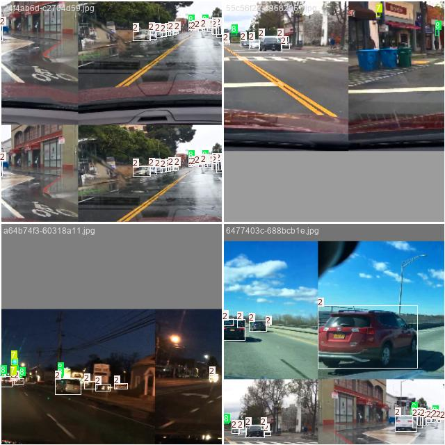 | 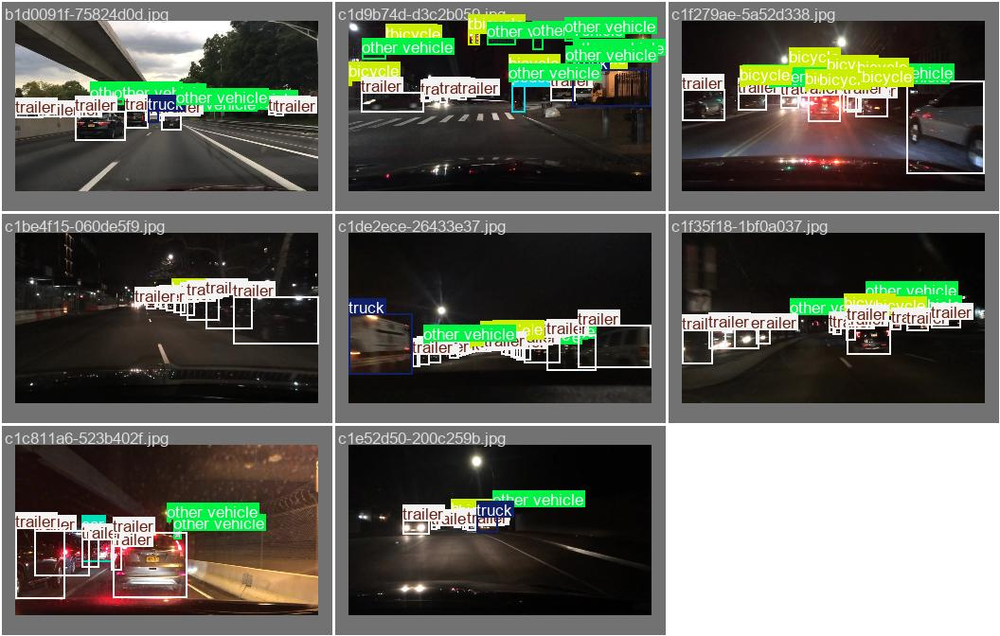 |
| 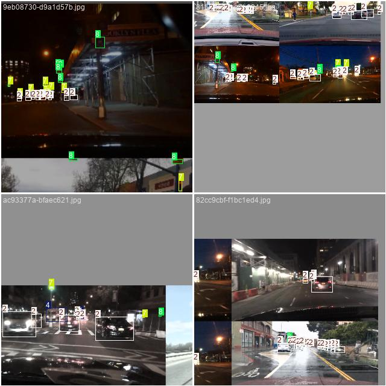 | 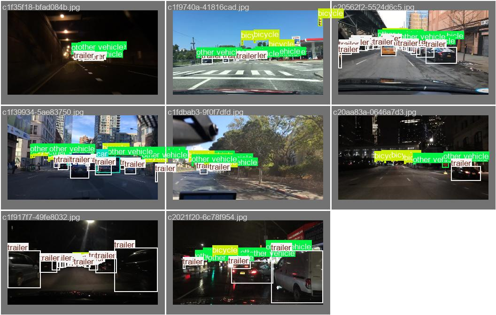 |
| 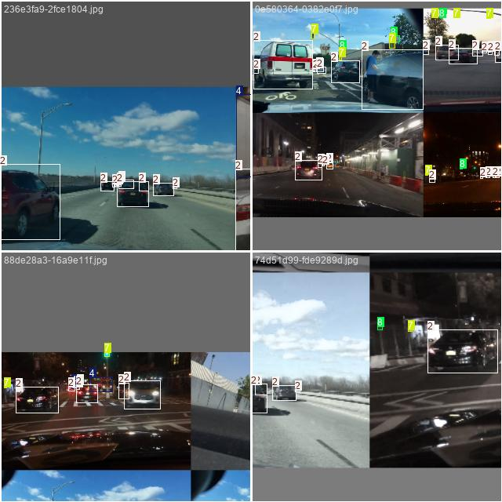 | 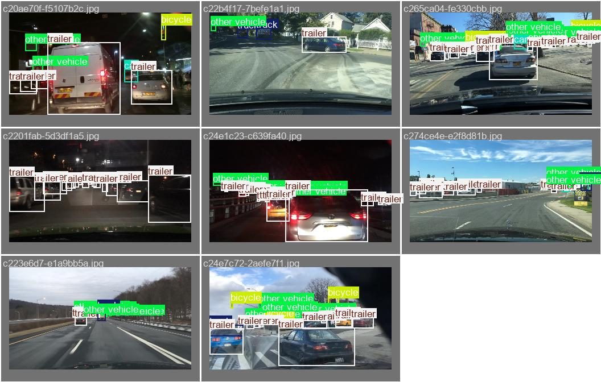 |

### Predictions vs Labels

| **Ground Truth Labels**            | **Predictions**                  |
|-----------------------------------|-----------------------------------|
| 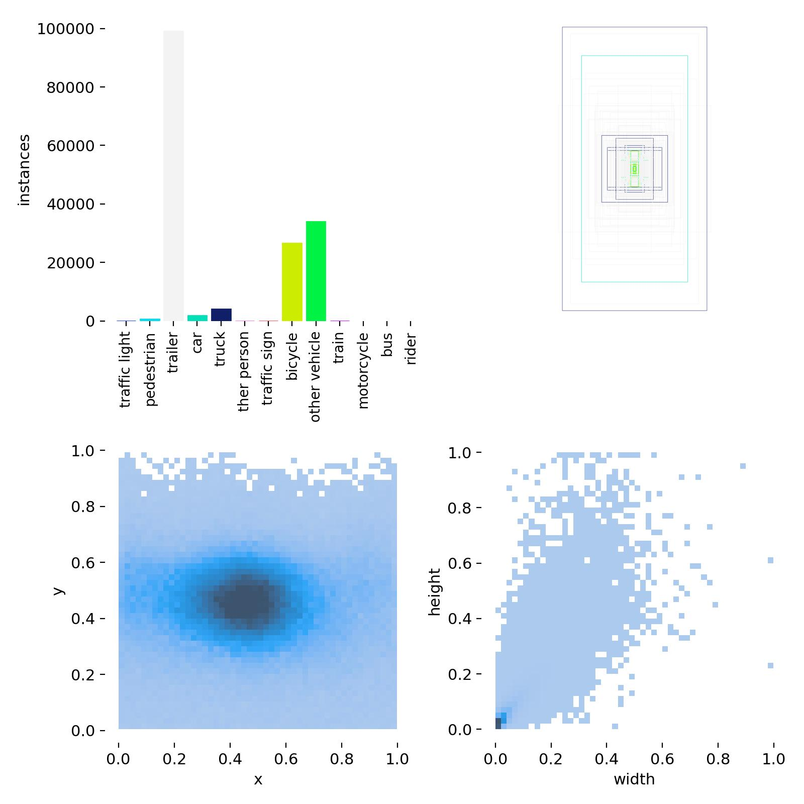             | 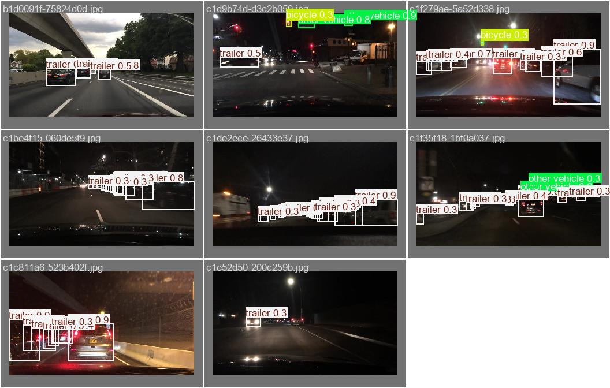 |
|  | 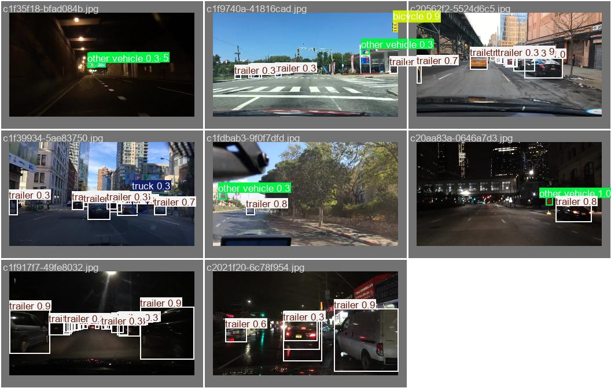 |
|  | 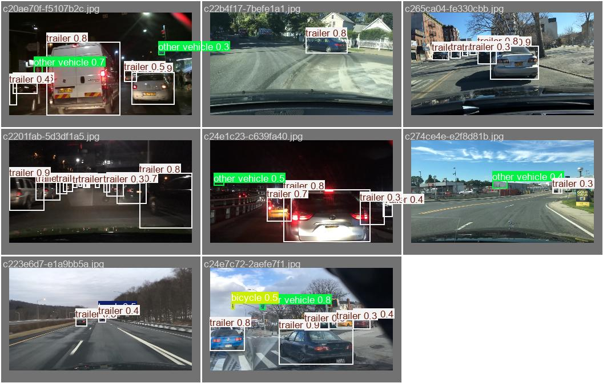 |

### Correlation and Correlogram

| **Correlogram Visualization**     |
|-----------------------------------|
| 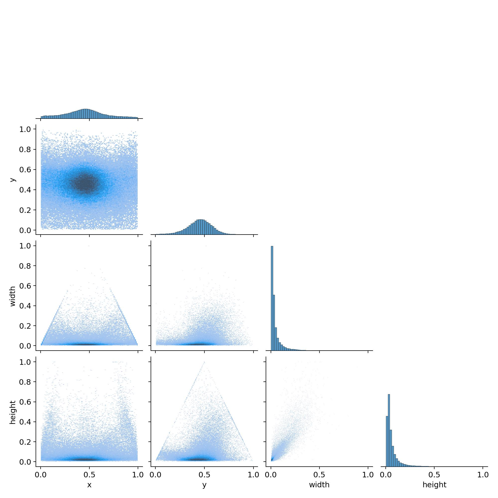 |

### Sample Test Video

Below is a placeholder for the test video output from the model. You can view how the model performs on a sample video here:

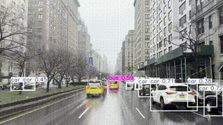

## Author

- **Samir K C (dwskme)**

## Acknowledgments

- Special thanks to contributors from Kaggle for the annotation converter scripts.
